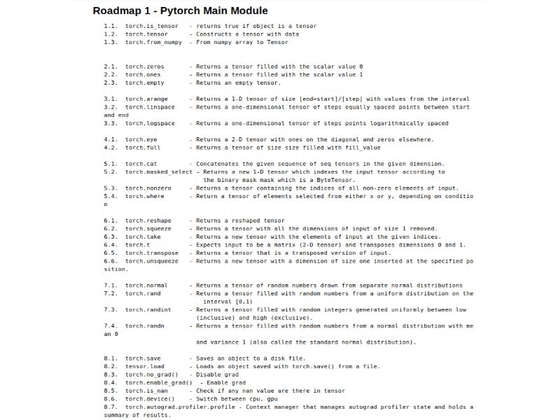

# Pytorch_Tutorial[](http://twitter.com/share?text=Check%20out%20Pytorch_Tutorial,%20A%20set%20of%20jupyter%20notebooks%20on%20pytorch%20functions%20with%20examples&url=https://github.com/Tessellate-Imaging/monk_v1&hashtags=MonkAI,OpenSource,Notebooks,DeepLearning,Tutorial,Pytorch,Python)
A set of jupyter notebooks on pytorch functions with examples
<br />
<br />
<br />

## Contents

<br />

- A) RoadMap 1 - Torch Main 1 - Basic Tensor functions.ipynb
- B) RoadMap 2 - Torch Main2 - Mathematical Operators.ipynb
- C) RoadMap 3 - Torch Main 3 - Linear Algebraic Operations.ipynb
- D) RoadMap 4 - Data 1 - Loader base codes.ipynb
- E) RoadMap 5 - Data 2 - Transformations (General).ipynb
- F) RoadMap 6 - Data 3 - Loader example codes.ipynb
- G) RoadMap 7 - Torch NN 1 - Convolution, Pooling and Padding Layers.ipynb
- H) RoadMap 8 - Torch NN 2 - Activation Layers.ipynb
- I) RoadMap 9 - Torch NN 3 - Other Layers.ipynb
- J) RoadMap 10 - Torch NN 4 - Initializers.ipynb
- K) RoadMap 11 - Torch NN 5 - Loss Functions.ipynb
- L) RoadMap 12 - Torch NN 6 - Base Modules.ipynb
- M) RoadMap 13 - Torch NN 7 - Optimizers and learning rate adjustment.ipynb
- N) RoadMap 14 - Classification 1 - Pytorch model zoo.ipynb
- O) RoadMap 15 - Classification 2 - Training & Validating [Custom CNN, Public Dataset].ipynb
- P) RoadMap 16 - Classification 3 - Training & Validating [Custom CNN, Custom Dataset].ipynb
- Q) RoadMap 17 - Classification 4 - Transfer learning [Custom Dataset, Learning Rate Scheduler, Model saver].ipynb
- R) RoadMap 18 - Appendix 1 - Replicating Classification 4 with Monk.ipynb
- S) RoadMap 19 - Appendix 2 - Fashion Classification with Monk.ipynb
- T) RoadMap 20 - Appendix 3 - Indoor Scene Classification with Monk.ipynb
- U) RoadMap 21 - Appendix 4 - American Sign Language Classification with Monk.ipynb
- V) RoadMap 23 - Appendix 5 - Plant Disease Classification with Monk.ipynb
- W) RoadMap 24 - Appendix 6 - Plant Disease Classification with Monk.ipynb
<br />
<br />
<br />


## Installation
```
pip install -r requirements.txt
```
<br />
<br />
<br />


## Author
Tessellate Imaging - https://www.tessellateimaging.com/
   
Check out Monk AI - (https://github.com/Tessellate-Imaging/monk_v1)
    
    Monk features
        - low-code
        - unified wrapper over major deep learning framework - keras, pytorch, gluoncv
        - syntax invariant wrapper

    Enables developers
        - to create, manage and version control deep learning experiments
        - to compare experiments across training metrics
        - to quickly find best hyper-parameters

To contribute to Monk AI or Pytorch_Tutoral repository raise an issue in the git-repo or dm us on linkedin 
   - Abhishek - https://www.linkedin.com/in/abhishek-kumar-annamraju/
   - Akash - https://www.linkedin.com/in/akashdeepsingh01/
<br />
<br />
<br />

## Copyright

Copyright 2019 onwards, Tessellate Imaging Private Limited Licensed under the Apache License, Version 2.0 (the "License"); you may not use this project's files except in compliance with the License. A copy of the License is provided in the LICENSE file in this repository.
